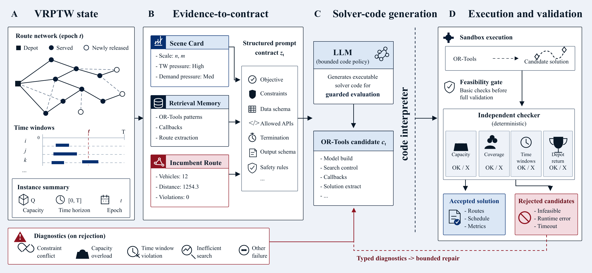

# SGC-VRPTW

Solver-grounded generative control for vehicle routing with time windows.

This repository contains the code, processed evidence tables, figure sources, and reproduction scripts for **SGC-VRPTW**, a workflow that uses an advanced LLM to instantiate solver behavior, execute generated programs, check feasibility independently, and repair failed attempts through feedback. OR-Tools cold-start routing is used as the deterministic baseline in the reported experiments.



## What Is Included

- `src/`: VRPTW schemas, loaders, baseline solvers, feasibility checking, LLM clients, and SGC execution pipelines.
- `scripts/experiments/`: batch scripts for static, dynamic, and benchmark-scale experiments.
- `scripts/analysis/`: aggregation, audit, and comparison utilities.
- `scripts/figures/`: scripts used to generate and audit evidence figures.
- `results/official/`: processed result records used for the paper-level analyses.
- `evidence/figure_sources/` and `evidence/tables/`: compact figure-source and evidence-summary tables.
- `data/toy/`: a small JSON instance for smoke tests and quick demos.

See `docs/DATA.md` for the benchmark layout expected by the loaders and experiment scripts.

## Method Naming

The project uses **SGC-VRPTW**. Some internal modules and historical result columns still contain `droc` in filenames or field names because they were generated by earlier experiment scripts and are referenced by existing result tables. In this repository, these names should be read as legacy implementation labels for the same solver-grounded generated-code workflow.

The reported protocols are:

- **OR-Tools baseline**: cold-start OR-Tools routing API under the configured time budget.
- **SGC, single retained run**: one retained SGC output per instance.
- **SGC, bounded-retry success**: an instance is counted as recovered if any bounded SGC attempt passes the independent feasibility checker.

## Quick Start

```bash
python -m venv .venv
source .venv/bin/activate
pip install -e ".[dev]"
```

Run the smoke tests and toy examples:

```bash
python -m pytest tests/test_toy_instance.py tests/test_ortools_smoke.py tests/test_llm_loop_smoke.py -q

python -m src.cli solve ortools data/toy/vrptw_tiny.json --time-limit 5
python -m src.cli sgc data/toy/vrptw_tiny.json --llm mock --max-iterations 2 --time-limit 20 --output-dir results/demo/sgc_tiny
```

Use an OpenAI-compatible LLM backend:

```bash
export OPENAI_API_KEY="..."
export OPENAI_MODEL="gpt-4o-mini"

python -m src.cli ping --llm openai
python -m src.cli sgc data/toy/vrptw_tiny.json --llm openai --max-iterations 4 --time-limit 60
```

For the reported experiments, set `OPENAI_MODEL` to the model used by the run. The evaluated backend is described as a GPT-5.4-class advanced LLM model.

## Reproducing The Evidence

The compact result records used by the analysis are stored in:

```text
results/official/
evidence/figure_sources/
evidence/tables/
```

Generated evidence figures are written to:

```text
evidence/qa/generated_figures/
```

For detailed commands and expected paths, see `docs/USAGE.md`.

## Repository Status

This public repository is intended for review and reproducibility. It provides the model workflow source code, solver settings, feasibility-checking logic, processed result records, figure-source tables, and plotting scripts needed to inspect and rerun the reported analyses.

## License

This repository is released under the MIT License. See `LICENSE` for details.

## Citation

If you use this repository, please cite the associated paper once the final bibliographic record is available.
